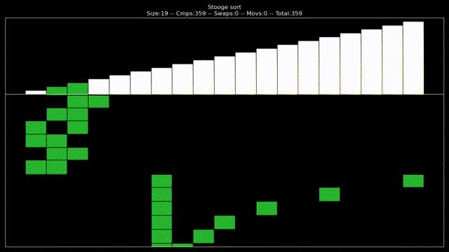

# sorting-midi
Sorting algorithms visualization and sonification with Matplotlib and MIDI.

**Youtube video**: https://youtu.be/MAGZo_FqQBI


# Stoogesort solo
Stoogesort has a really nice rhythm to it, so I made a 3 minute version with just this sorting algorithm. The array is already sorted so no swaps are made, which would break the nice rhythm. It also has a slower tempo at 90 BPM, instead of the original 120 BPM.

**Stoogesort video**: https://youtu.be/X83L1FvMDWI



# How it works
Each sorting algorithm is implemented so that it uses 3 basic array operations:
1. CMP: compare the values of two locations in memory
2. SWAP: swap the values of two locations in memory
3. MOV: set the destination value equal to the source value (only used for mergesort)

These operations are recorded and then converted into MIDI notes:
- The **pitch** of the notes depends on the memory address accessed. Higher addresses result in higher pitch.
- The **duration** of the notes depends on the number of python `opcodes` executed between operations. See env/__init__.py, _local_trace() and _global_trace(), for the implementation. `sys.settrace` is used to count the `opcodes`.
- The **channel** in which a note is generated depends on the array operation:
    - CMP: both left channel (colored green)
    - SWAP: both right channel (colored red)
    - MOV: destination is in right channel (red), source is in left channel (green)

For algorithms that use auxiliary memory arrays (mergesort), these are represented as well, with the same rules as above, but they can use a different MIDI instrument.

# Requirements
**Python 3.8+**

**Python modules**:
- matplotlib
- mido
- numpy
- tqdm
- pytest (for validating the sorting algorithms)

**External**:
- ffmpeg (in PATH)
- TiMidity++ (for converting MIDI to WAV): https://sourceforge.net/projects/timidity/

# How to run
### Rendering
```
python main.py -s SORT -n SIZE [--bpm BPM]
```
`SORT` is the filename of a sorting algorithm from `sorts/`. `SIZE` is the array size to use for the sort. The values in the array are initialized randomly. `BPM` dictates the tempo of the notes (default 120). 

The path to the `TiMidity` executable is specified in `render.py`, using `TIMIDITY = 'timidity.exe'`. `timidity.exe` is provided in the repo, but it only works on Windows. For Linux and Mac you can download TiMidity from the link above, in the Requirements section.

### Testing

You can test that all algorithms in `sorts/` work correctly by running `tests/test_sorts.py`.
```
python -m pytest
```

# 21 Sorting Algorithms:
1. Bitonic sort
2. Bubble sort
3. Cocktail Shaker sort
4. Comb sort
5. Gnome sort
6. Heapsort
7. Heapsort (Bottom-Up)
8. Insertion sort
9. Insertion sort (Binary)
10. Introsort
11. Merge sort
12. Merge sort (Half Buffer)
13. Odd-even Sort
14. Quicksort (Hoare)
15. Quicksort (Lomuto)
16. Selection sort
17. Selection sort (Bidirectional)
18. Shellsort
19. Slowsort
20. Smoothsort
21. Stooge sort 

